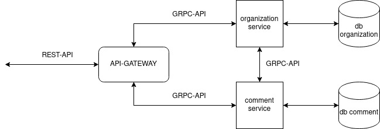

# Simple Golang Microservice

This repo is basic implementation of golang's microservices.



## Requirement

1. golang 1.18 (to devdelop)

2. [Docker](https://docs.docker.com/get-started/) and  [Docker Compose](https://docs.docker.com/compose/)


## How to run

### Makefile
Each folder contains their own makefile.

Running all-of-it we could using `make run` in root dir.

### docker
Using root dir's `docker-compose.yml` to run as a containerized microservices

```bash
docker-compose up -d
```

and

```
docker-compse stop
```

## How to try

### Postman
You could use `postman_collection.json` file and import to your own postman app.

## Contributing
Pull requests are welcome. For major changes, please open an issue first to discuss what you would like to change.

Please make sure to update tests as appropriate.

## License
```
Everyone feel free to contribute
```